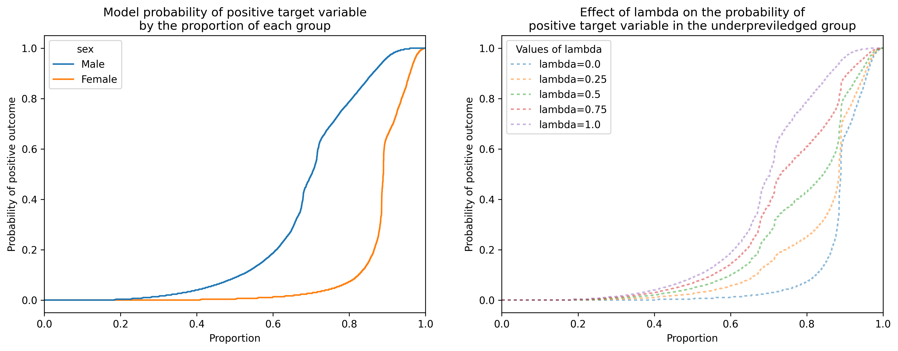
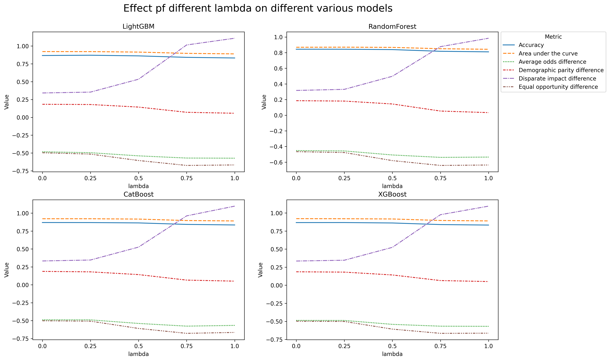
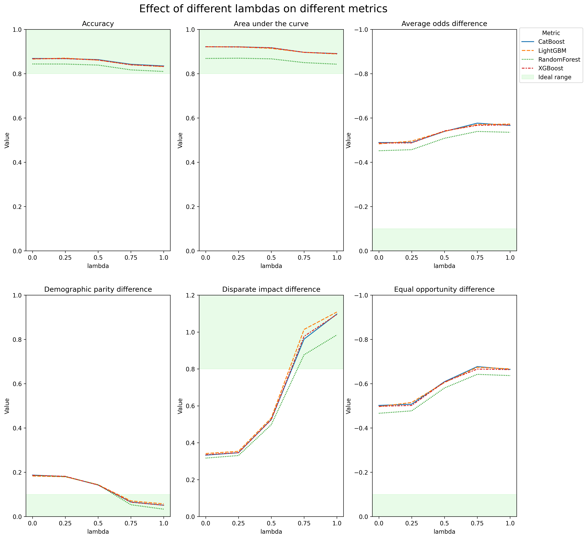

# Strong-statistical-parity-through-fair-synthetic-data

This repository an analysis on synthetic model fairness based on the paper:

- "Strong statistical parity through fair synthetic data" - <https://arxiv.org/pdf/2311.03000.pdf>

# Reflected Insights

Through the course of experimentation and implementation, a crucial revelation emerged: the model exhibited a pronounced inclination towards the protected variable, underscoring the need for mitigation strategies in the realm of AI. The proposition of rebalancing the representation unprivileged groups, even at the cost of marginal compromises in evaluation metrics, stands out as a compelling avenue for addressing this issue.

The prospect of aligning the proportions of these groups holds significant promise, particularly in domains such as recommenders or classifiers. By tempering the undue influence of the protected variable, we not only enhance the fairness of AI outcomes but also pave the way for more equitable and unbiased algorithmic decision-making. These findings resonate with the broader discourse on ethical AI, reinforcing the notion that prioritizing fairness is not just a desirable objective but an imperative for the future development and deployment of artificial intelligence.

# Main takeaways

- Aligning the true positive rates of all groups is a priority - this metric is encapsulated by the SPD (Strong Demographic Parity) metric.
- Train aditional classifiers that generate a probabilty that we can leverage with a given parameter Fairness Parameter (λ)
- This parameter allows for adjusting the level of fairness correction, from no correction (λ = 0) to fully matching the sampling probabilities of the unprivileged class to the privileged class (λ = 1).

This is better visualized in the figure 1:

Figure 1: the effect of the value of the fairness parameter (λ) on the probability of positive outcome for the unprivilidged group

- Two crucial requirements for fairness were identified - the synthetic data generator must preserve the distribution of real data, especially in terms of positive rates for different groups, and the downstream model must accurately predict the target variable in line with the synthetic data generator.

# Conclusions

The figure 2 below ilustrates the effect of different Fairness Parameter (λ) over various models and how we can optimize the fairness metric (SPD) with only marginal decrease in other evaluation metrics.

Figure 2: Values of lambda on the evaluation metrics over various models

The paper only showed the effect of Social Parity Difference on the models, wanted to explore how other fairness metrics would be affected, the results are show in figure 3:

Figure 3: the effect of different lambdas various metrics.

As seen above, only Social parity difference and disparate impact difference improved in value, both of which are directly correlated and take into account the unpreviledged group, other metrics that take into account also the previledged group do not fair so well.
