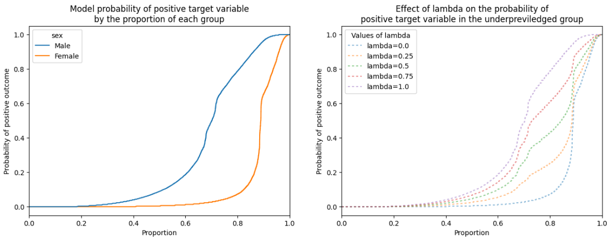
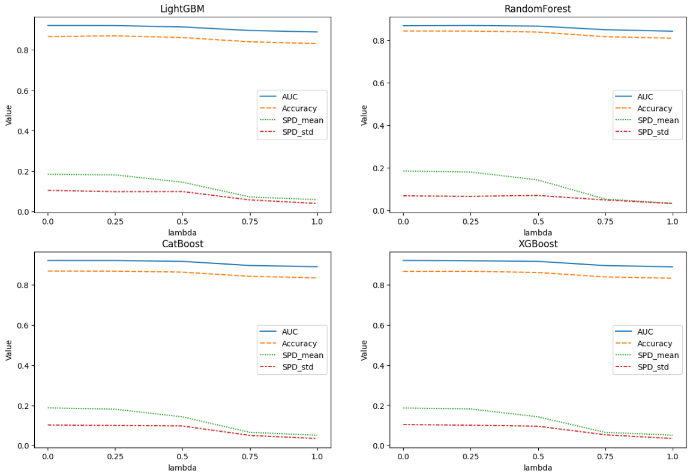

# Strong-statistical-parity-through-fair-synthetic-data

This repository contains my implementation of the paper "Strong statistical parity through fair synthetic data" - <https://arxiv.org/pdf/2311.03000.pdf>

# Understanding Fair AI: A Synopsis of "Strong Statistical Parity Through Fair Synthetic Data"

In the ever-evolving landscape of artificial intelligence, ensuring fairness in algorithmic decision-making is a critical concern. The paper "Strong Statistical Parity Through Fair Synthetic Data" delves into approaches aimed at mitigating biases and disparities in AI models. The central focus lies in addressing the challenge of penalizing disadvantaged groups solely based on specific variables, thereby striving for equitable outcomes.

As AI systems become increasingly integrated into various aspects of our lives, it becomes imperative to scrutinize and rectify any biases that may inadvertently emerge. The paper proposes alternative methods, particularly emphasizing the use of fair synthetic data, to bolster statistical parity. The goal is to achieve a balance where AI results are not unduly skewed against groups facing inherent disadvantages.

This synopsis aims to distill the key concepts presented in the paper, shedding light on the strategies employed to uphold fairness in the realm of artificial intelligence. By exploring these techniques, I aspire to contribute to the ongoing dialogue on ethical AI and pave the way for more inclusive.

# Reflected Insights

Through the course of experimentation and implementation, a crucial revelation emerged: the model exhibited a pronounced inclination towards the protected variable, underscoring the imperative need for mitigation strategies in the realm of AI. The proposition of rebalancing the representation of both privileged and unprivileged groups, even at the cost of marginal compromises in evaluation metrics, stands out as a compelling avenue for addressing this issue.

The prospect of aligning the proportions of these groups holds significant promise, particularly in domains such as recommenders or classifiers. By tempering the undue influence of the protected variable, we not only enhance the fairness of AI outcomes but also pave the way for more equitable and unbiased algorithmic decision-making. These findings resonate with the broader discourse on ethical AI, reinforcing the notion that prioritizing fairness is not just a desirable objective but an imperative for the future development and deployment of artificial intelligence.

# Main takeaways

- Aligning the true positive rates of all groups is a priority - this metric is encapsulated by the SPD (Strong Demographic Parity) metric.
- Train aditional classifiers that generate a probabilty that we can leverage with a given parameter Fairness Parameter (λ)
- Ranging from zero to one. This parameter allows for adjusting the level of fairness correction, from no correction (λ = 0) to fully matching the sampling probabilities of the unprivileged class to the privileged class (λ = 1).

This is better visualized in the figure 1:

Figure 1: the effect of the value of the fairness parameter (λ) on the probability of positive outcome for the unprivilidged group

- Two crucial requirements for fairness were identified - the synthetic data generator must preserve the distribution of real data, especially in terms of positive rates for different groups, and the downstream model must accurately predict the target variable in line with the synthetic data generator.

# Conclusions

The figure 2 below ilustrates the effect of different Fairness Parameter (λ) over various methods and how we can optimize the fairness metric (SPD) with only marginal decrease in other evaluation metrics.

Figure 2: Values of lambda on the evaluation metrics over various models
